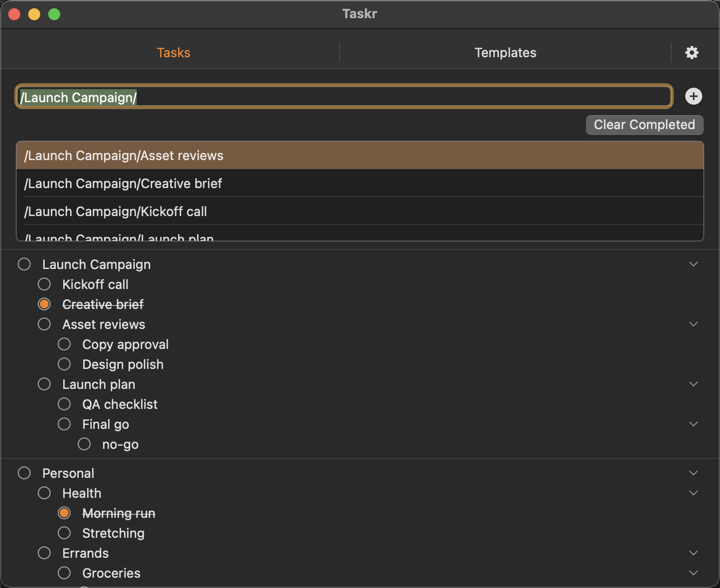

# Taskr

Taskr is a lightweight macOS menu bar companion for rapidly capturing and organizing nested checklists. The app stays out of the way until you trigger it with your global hotkey (default `⌃⌥N`) or click the menu bar icon, letting you focus on the tasks you want to track.

## Features
- **Fast path-based capture** – Create deeply nested tasks in one line using `/`-delimited paths with optional quoted segments.
- **Keyboard-first navigation** – Move with ↑/↓, expand with →, collapse with ←, reorder with M+↑/↓, Shift+Tab to toggle focus, Return to add, Esc to clear.
- **Readable copy & paste** – Copy selections as a clean checklist for pasting into docs, notes, or tickets.
- **Reusable templates** – Author checklists once and apply them to live tasks without duplicating work.
- **Flexible views** – Work from the menu bar or pop out a full window when you need more space.
- **Preferences in one place** – Tune hotkeys, insertion defaults, themes, and animations without leaving the app.
- **Import & export** – Back up or move tasks and templates with JSON round-trips.
- 
- 
- 
- 

## Requirements
- macOS 14.0 or newer
- Xcode 15.4 or newer (SwiftData + SwiftUI)

## Getting Started
```bash
# Open the project in Xcode
open taskr.xcodeproj

# Or build from the command line
xcodebuild -project taskr.xcodeproj -scheme taskr -configuration Debug build
```

When you run the app for the first time macOS will prompt for accessibility access so Taskr can register the global hotkey. Approve the request from **System Settings → Privacy & Security → Accessibility**.

## Updating
Taskr does not include an in-app updater yet. To update:
- Quit Taskr.
- Download the latest release.
- Replace `Taskr.app` in `/Applications` with the new copy.
- Relaunch Taskr.

## License
Taskr is released under the MIT License. See [LICENSE](LICENSE) for details.
